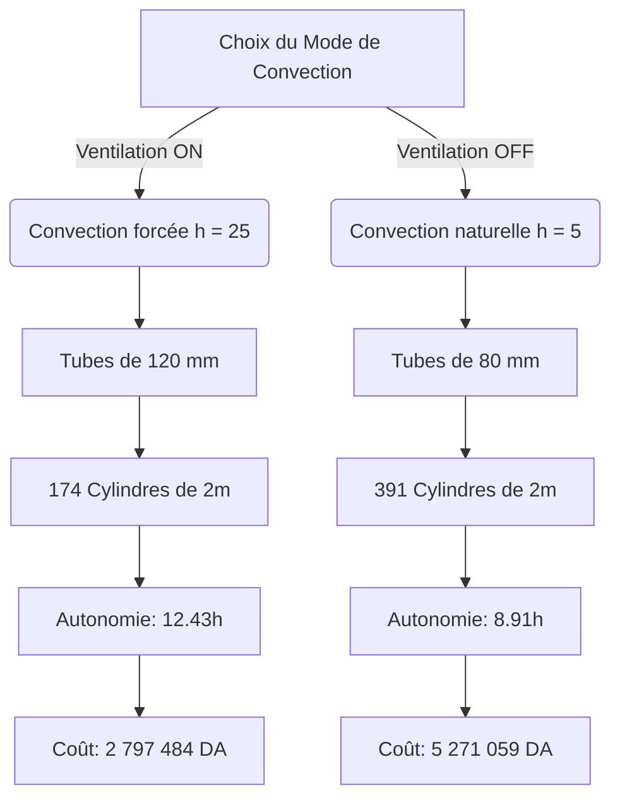

# Rapport d'Analyse Thermodynamique & Recommandations de Conception (TES)

Ce document présente les résultats de la simulation thermique pour le dimensionnement optimal de la batterie de stockage d'énergie thermique (TES) à changement de phase (MCP) pour la chambre froide de $100\text{ m}^3$ (Consignes de $+4^\circ\text{C}$ et $-18^\circ\text{C}$).

---

## 1. Synthèse de l'Optimum pour le cas **Ventilateur OFF** (Convection Naturelle)

Dans le cas où la ventilation de décharge est inactive (**Ventilateur OFF**), le coefficient de convection s'effondre à $h = 5\text{ W/(m}^2\text{.K)}$. Le transfert thermique devient le facteur limitant majeur (goulot d'étranglement).

Pour compenser ce faible coefficient d'échange et permettre à la paraffine de libérer ses frigories à un débit suffisant, la géométrie de l'échangeur doit être fortement divisée pour maximiser la surface d'échange par unité de volume.

### Configurations Optimales (Ventilateur OFF) :

| Temp. Cible | Temp. Ext. Ambiante | Diamètre Cylindre | Épaisseur Paroi Al | Nombre d'Ailettes | Longueur Cylindre | Espace Vide (Ciel) | Masse MCP | Masse Aluminium | Nombre de Modules | Coût Total Estimé | Autonomie Réelle |
| :--- | :--- | :--- | :--- | :--- | :--- | :--- | :--- | :--- | :--- | :--- | :--- |
| **$+4^\circ\text{C}$** | $35^\circ\text{C}$ | **$80\text{ mm}$** | $2.0\text{ mm}$ | **$8$ ailettes** | **$2.0\text{ m}$** | $10\%$ | $1578\text{ kg}$ | $1460\text{ kg}$ | **$226$ tubes** | **$3\,046\,217\text{ DA}$** | **$5.94\text{ heures}$** |
| **$-18^\circ\text{C}$** | $35^\circ\text{C}$ | **$80\text{ mm}$** | $2.0\text{ mm}$ | **$8$ ailettes** | **$2.0\text{ m}$** | $10\%$ | $2730\text{ kg}$ | $2526\text{ kg}$ | **$391$ tubes** | **$5\,271\,059\text{ DA}$** | **$8.91\text{ heures}$** |

> [!WARNING]
> **Alerte Performance (Ventilateur OFF)**  
> Même en adoptant la géométrie la plus performante (tubes fins de $80\text{ mm}$ avec le maximum d'ailettes, soit $8$), l'autonomie cible de **$13\text{ heures}$** n'est jamais atteinte (elle plafonne à **$5.94\text{h}$** pour le positif et **$8.91\text{h}$** pour le négatif). La puissance maximale de la batterie en convection naturelle est insuffisante pour couvrir la charge thermique de la chambre froide.

---

## 2. Comparaison Technico-Économique : Ventilation ON vs OFF

L'intégration d'un ventilateur (convection forcée, $h = 25\text{ W/(m}^2\text{.K)}$) transforme radicalement le dimensionnement et la viabilité économique du projet.

### Scénario Froid Négatif ($-18^\circ\text{C}$) à Température Extérieure de $35^\circ\text{C}$ :

### Analyse Comparative :
* **Masse d'Aluminium** : Elle est divisée par **2.5** en passant de la ventilation OFF ($2526\text{ kg}$) à la ventilation ON ($1011\text{ kg}$). Les tubes plus larges ($120\text{ mm}$ au lieu de $80\text{ mm}$) nécessitent beaucoup moins de matière d'enveloppe pour contenir le même volume de MCP.
* **Complexité Industrielle** : On passe de **$391$ modules** à fabriquer et souder à seulement **$174$ modules**. C'est une réduction drastique du temps d'usinage, d'assemblage et du risque de fuite de paraffine.
* **Autonomie Réelle** : L'autonomie fait un bond de **$8.91\text{ h}$** à **$12.43\text{ h}$** (très proche des $13\text{ h}$ cibles), car l'échangeur est capable de transférer les calories rapidement.
* **Bilan Financier** : Le coût total s'effondre de **$5.27\text{ millions de DA}$** à **$2.80\text{ millions de DA}$** (soit une économie nette de **$2.47\text{ millions de DA}$**, ventilateur et onduleur inclus !).

---

## 3. Recommandations de Conception Finale (Cahier des Charges CAO/SolidWorks)

Pour la modélisation sous SolidWorks et la fabrication, voici les dimensions optimales à retenir pour concevoir la batterie thermique la plus performante et la plus économique :

### 1. Caractéristiques Géométriques des Cylindres (Modules)
* **Diamètre Extérieur ($D_{\text{ext}}$)** : **$120\text{ mm}$**
* **Épaisseur de Paroi Aluminium** : **$2.0\text{ mm}$**
* **Longueur utile du Cylindre ($L$)** : **$2.0\text{ m}$**
  * *Note : Les cylindres de $2.0\text{ m}$ maximisent le volume par module, réduisant le nombre total de pièces à manipuler et le coût d'assemblage.*

### 2. Ailettes en Aluminium (Alu 6061-T6 ou similaire)
* **Nombre d'ailettes externes** : **$4$ ailettes** pour le froid négatif ($-18^\circ\text{C}$) ou **$8$ ailettes** pour le froid positif ($+4^\circ\text{C}$).
* **Longueur des ailettes ($L_f$)** : **$30\text{ mm}$**
* **Épaisseur des ailettes ($t_f$)** : **$1.5\text{ mm}$**

### 3. Remplissage et Dilatation
* **Espace vide de remplissage (Ciel Gazeux)** : **$10\%$**
  * *Justification : Notre étude montre que la configuration avec $10\%$ d'espace vide offre le meilleur compromis. Elle laisse la marge nécessaire de $10\%$ pour la dilatation volumique de la paraffine lors du changement de phase solide/liquide tout en optimisant le volume utile de stockage.*

### 4. Spécifications Générales du Système
* **Ventilation** : **Système de ventilation forcée obligatoire (ON)**. L'intégration de ventilateurs de décharge alimentés via un onduleur est le cœur de la viabilité physique et financière du stockage thermique.

---

## 4. Tableau de Synthèse pour la Fabrication

| Paramètre | Froid Positif ($+4^\circ\text{C}$) | Froid Négatif ($-18^\circ\text{C}$) |
| :--- | :--- | :--- |
| **Diamètre Cylindre** | $120\text{ mm}$ | $120\text{ mm}$ |
| **Longueur Cylindre** | $2.0\text{ m}$ | $2.0\text{ m}$ |
| **Nombre d'Ailettes** | $8$ | $4$ |
| **Taux d'espace vide** | $10\%$ | $10\%$ |
| **Nombre de Cylindres** | **$101$ tubes** | **$174$ tubes** |
| **Masse MCP totale** | $1578\text{ kg}$ | $2730\text{ kg}$ |
| **Masse Aluminium** | $830\text{ kg}$ | $1011\text{ kg}$ |
| **Autonomie Réelle** | **$12.17\text{ heures}$** | **$12.43\text{ heures}$** |
| **Coût Total Estimé** | **$1\,991\,637\text{ DA}$** | **$2\,797\,484\text{ DA}$** |
